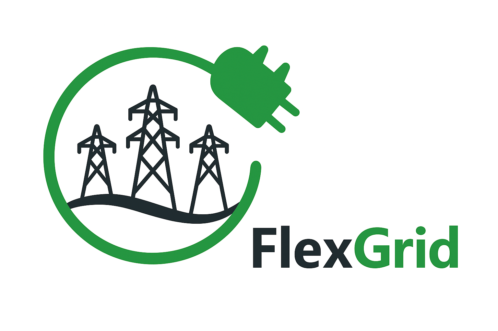

Welcome to FlexGridPy's documentation!
======================================

**FlexGridPy** is a Python library for researchers and engineers
working on the intelligent operation of power systems.
It provides modular tools for:

- modeling and solving convex and non-convex Optimal Power Flow (OPF) problems,
- optimizing electric vehicle (EV) and distributed energy resource (DER) integration,
- building and tuning grey-box thermal models for residential buildings and heat pumps,
- electricity market clearing (copperplate and DC-OPF),
- probabilistic transportation data generation for EV studies.

FlexGridPy is designed for **flexibility-aware modeling**, combining control,
simulation, and optimization in a unified and extensible framework.

It integrates seamlessly with common open-source tools (Pyomo, NumPy, Pandas,
Matplotlib, pandapower) and supports scalable experiments for scientific
publications, demo cases, and industrial applications.

Check out the :doc:`usage` section for installation and a minimal example.

.. note::

   This project is under active development.

Contents
--------

.. toctree::
   :maxdepth: 2
   :caption: Getting Started

   usage

.. toctree::
   :maxdepth: 2
   :caption: Electrical Models

   electrical_models/index

.. toctree::
   :maxdepth: 2
   :caption: Market

   market/index

.. toctree::
   :maxdepth: 2
   :caption: Building Modeling

   building_modeling/index

.. toctree::
   :maxdepth: 2
   :caption: Transportation

   transportation/index

.. toctree::
   :maxdepth: 2
   :caption: About FlexGridPy

   About
